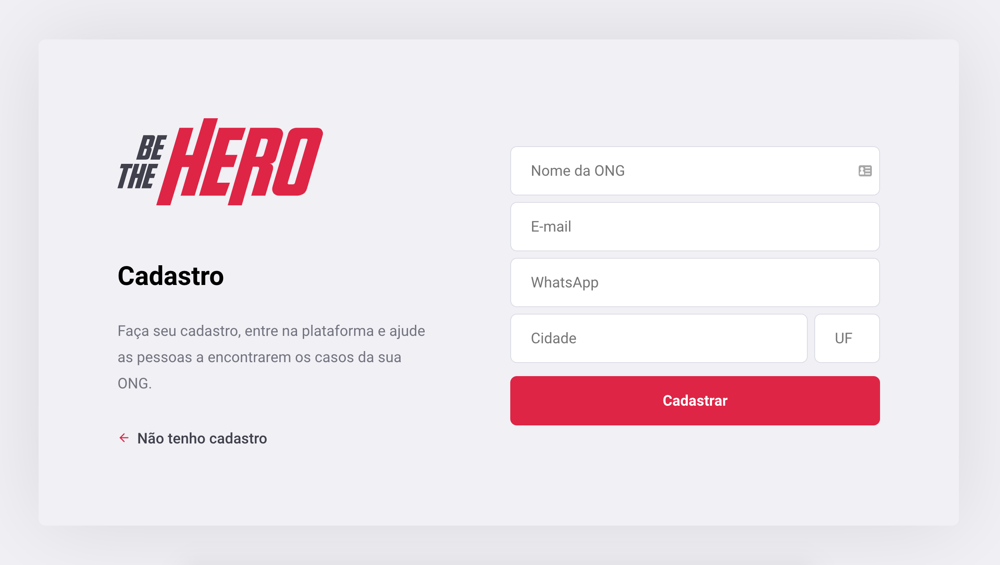
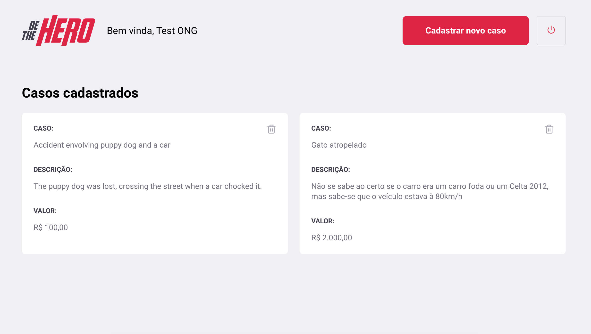
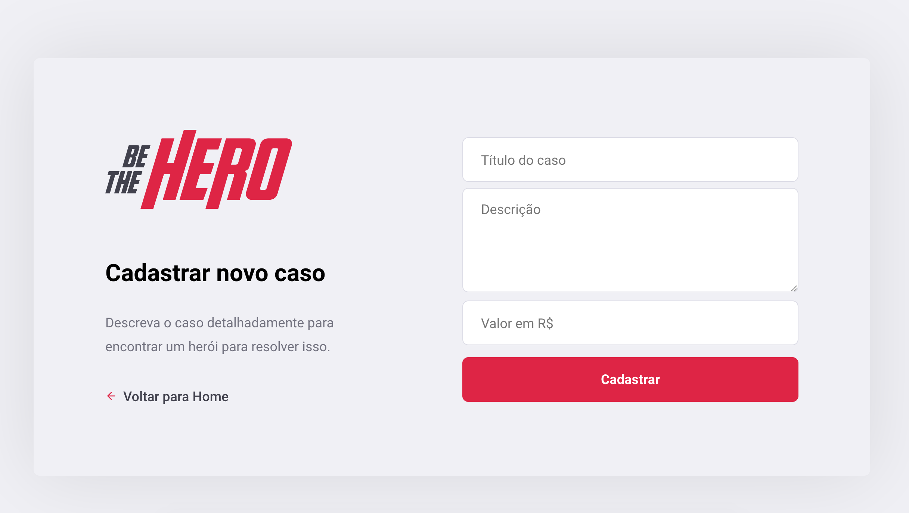

# Be The Hero

It's a simple app to help your city's ONGs to tell everyone that they need your support to handle some incidents or another cases that demands a considerable money fund.








#### **Technologies and Frameworks:**
* Node.js
* Cors
* Express
* Knex
* SQLite
* React (with react-dom, react-router-dom, react-icons)
* Axios

#### How to run

Make sure you have [Nodemon](https://www.npmjs.com/package/nodemon) installed, then run the command below (inside `backend` folder) the start backend and database:
```bash
$ npm start
```

Do the same with `frontend` folder and run the command bellow to get application up:
```
$ npm start
```

Now, open your favorite browser and access http://localhost:3000

* Obs.: backend will run on port 3333, so that's why [Postman's collection](postman_collection.json) use this port.
